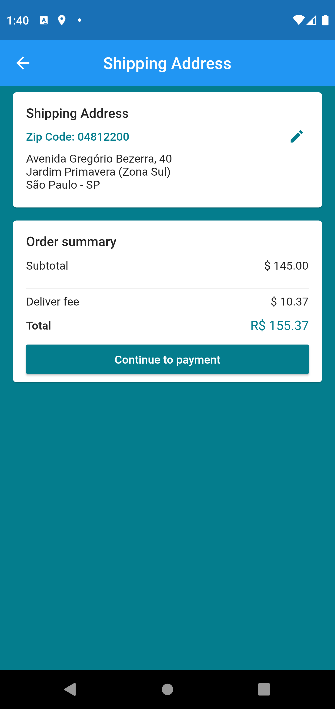

# Virtual Store App

A Flutter course from Udemy by Daniel Sciolfi.
This reference project shows how to implement a virtual store (e-commerce) in Flutter:

  
   
  
  
  
  
  
  
  
  
  
  

The project uses Firebase for (remote) storage of the data and manage the products and images.
  
# App Overview
  
The application is composed by several functionalities as a typical e-commerce app such as: login, logout,
  cart screen, orders, payment and so forth. It also includes a "owner mode" in order to be able to edit all the information
  that will be displayed to the customers.

# Packages

The app uses the following packages:
 
 - [provider](https://pub.dev/packages/path_provider)
 - [cloud_firestore](https://pub.dev/packages/cloud_firestore)
 - [firebase_auth](https://pub.dev/packages/firebase_auth)
 - [firebase_storage:](https://pub.dev/packages/firebase_storage)
 - [provider](https://pub.dev/packages/path_provider)
 - [provider](https://pub.dev/packages/path_provider)
 - [provider](https://pub.dev/packages/path_provider)
 - [provider](https://pub.dev/packages/path_provider)
 - [provider](https://pub.dev/packages/path_provider)
 - [provider](https://pub.dev/packages/path_provider)
 - [provider](https://pub.dev/packages/path_provider)
 - [provider](https://pub.dev/packages/path_provider)
  
  alphabet_list_scroll_view: 
  brasil_fields: 
  carousel_pro: 
  credit_card_type_detector: 
  cupertino_icons: 
  dio:
  faker: 
  flip_card: 
  flutter:
    sdk: flutter
  flutter_facebook_login: 
  flutter_signin_button: 
  flutter_staggered_grid_view: 
  gallery_saver: 
  geolocator: 
  image_cropper: 
  image_picker: 
  lint:
  map_launcher: 
  mask_text_input_formatter: 
  screenshot: 
  sliding_up_panel:
  transparent_image:
  url_launcher: 
  uuid: 
